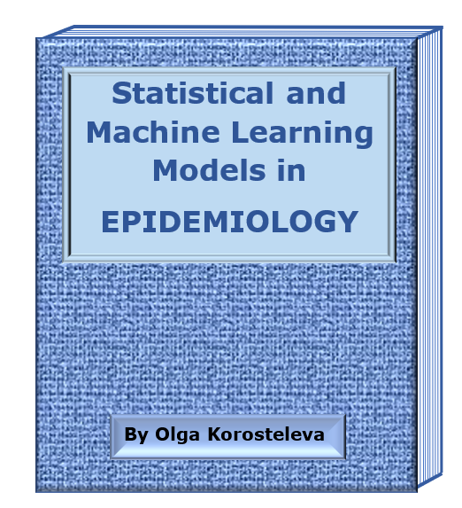

<html>

 

  <h1>STATISTICAL MODELS IN EPIDEMIOLOGICAL RESEARCH WITH SAS AND R APPLICATIONS</h1>
  <h3>by Olga Korosteleva,</h3>
  <h3><i>California State University, Long Beach</i></h3>
 

   

   
  

   
      
 
<h3>CHAPTER 1 GRAPHICAL DATA PRESENTATION</h3>

 <blockquote>
   
<a href="1_1_BarGraphs.pdf">1.1 Bar Graphs</a>&nbsp;&nbsp;&nbsp;<a href="diabetes_data1.csv">DATA_SET.CSV</a>&nbsp;&nbsp;&nbsp;<a href="BarGraphs.sas">SAS_CODE.SAS</a>&nbsp;&nbsp;&nbsp;<a href="BarGraphs.R">R_CODE.R</a>

   
<a href="1_2_Histogram.pdf">1.2 Histogram</a>&nbsp;&nbsp;&nbsp;<a href="diabetes_data2.csv">DATA_SET.CSV</a>&nbsp;&nbsp;&nbsp;<a href="Histogram.sas">SAS_CODE.SAS</a>&nbsp;&nbsp;&nbsp;<a href="Histogram.R">R_CODE.R</a>

  
1.3 Box Plot

   
<a href="1_4_TimeSeriesPlot.pdf">1.4 Time Series Plot</a>&nbsp;&nbsp;&nbsp;DIABETES EXAMPLE:&nbsp;<a href="diabetes_data3.csv">DATA_SET.CSV</a>&nbsp;&nbsp;&nbsp;<a href="TimeSeriesPlot1.sas">SAS_CODE.SAS</a>&nbsp;&nbsp;&nbsp;<a href="TimeSeriesPlot1.R">R_CODE.R</a> 
   POLLUTION EXAMPLE:&nbsp;<a href="pollution_data.csv">DATA_SET.CSV</a>&nbsp;&nbsp;&nbsp;<a href="TimeSeriesPlot2.sas">SAS_CODE.SAS</a>&nbsp;&nbsp;&nbsp;<a href="TimeSeriesPlot2.R">R_CODE.R</a>

 
<a href="1_5_ChoroplethMaps.pdf">1.5 Choropleth Maps</a>&nbsp;&nbsp;&nbsp;DATASETS FOR SAS:&nbsp;
    <a href="WestNileVirusCasesSAS.csv">1.CSV</a>&nbsp;&nbsp;&nbsp; 
    <a href="CA_Diabetes_by_CountySAS.csv">2.CSV</a>&nbsp;&nbsp;&nbsp; 
    <a href="AfricaMalariaCases.csv">3.CSV</a> 
    DATASETS FOR R:&nbsp;
    <a href="WestNileVirusCasesR.csv">1.CSV</a>&nbsp;&nbsp;&nbsp; 
    <a href="CA_Diabetes_by_CountyR.csv">2.CSV</a>&nbsp;&nbsp;&nbsp; 
    <a href="AfricaMalariaCases.csv">3.CSV</a>&nbsp;&nbsp;&nbsp;<a href="ChoroplethMaps.sas">SAS_CODE.SAS</a>&nbsp;&nbsp;&nbsp;<a href="ChoroplethMaps.R">R_CODE.R</a>

  </blockquote>
 
<h3>CHAPTER 2 CONFIDENCE INTERVALS AND HYPOTHESES TESTING</h3>

 <blockquote>
  
<a href="2_1_ExactBinomialTest_CI.pdf">2.1 Exact Binomial Test and Confidence Interval for Prevalence Proportion</a>&nbsp;&nbsp;&nbsp;<a href="ExactBinomialTest_CI.sas">SAS_CODE.SAS</a>&nbsp;&nbsp;&nbsp;<a href="ExactBinomialTest_CI.R">R_CODE.R</a>

  
<a href="2_2_ExactPoissonTest_CI.pdf">2.2 Exact Poisson Test and Confidence Interval for Incidence Rate</a>&nbsp;&nbsp;&nbsp;<a href="ExactPoissonTest_CI.sas">SAS_CODE.SAS</a>&nbsp;&nbsp;&nbsp;<a href="ExactPoissonTest_CI.R">R_CODE.R</a>

  
<a href="2_3_CIs_RR_OR_IRR.pdf">2.3 Confidence Intervals for Relative Risk, Odds Ratio, and Incidence Rate Ratio</a>&nbsp;&nbsp;&nbsp;<a href="CIs_RR_OR_IRR.sas">SAS_CODE.SAS</a>&nbsp;&nbsp;&nbsp;<a href="CIs_RR_OR_IRR.R">R_CODE.R</a>&nbsp;&nbsp;&nbsp;TUBERCULOSIS EXAMPLE:&nbsp;<a href="TB_symptoms_data.csv">DATA_SET.CSV</a>&nbsp;&nbsp;&nbsp;<a href="TB_Example.sas">SAS_CODE.SAS</a>&nbsp;&nbsp;&nbsp;<a href="TB_Example.R">R_CODE.R</a>

 </blockquote>
 
<h3>CHAPTER 3 NONPARAMETRIC STATISTICAL TESTS</h3>

  <blockquote>
  
<a href="3_1_WilcoxonRankSumTest.pdf">3.1 Wilcoxon Rank-Sum Test</a>&nbsp;&nbsp;&nbsp;<a href="WilcoxonRankSumTest.sas">SAS_CODE.SAS</a>&nbsp;&nbsp;&nbsp;<a href="WilcoxonRankSumTest.R">R_CODE.R</a>

     
<a href="3_2_KruskalWallisHTest.pdf">3.2 Kruskal-Wallis H-Test</a>&nbsp;&nbsp;&nbsp;<a href="KruskalWallisHTest.sas">SAS_CODE.SAS</a>&nbsp;&nbsp;&nbsp;<a href="KruskalWallisHTest.R">R_CODE.R</a>

 </blockquote>
 
<h3>CHAPTER 4 REGRESSION ANALYSIS</h3>

 <blockquote>
  
<a href="4_1_BinaryLogisticRegression.pdf">4.1 Binary Logistic Regression</a>&nbsp;&nbsp;&nbsp;<a href="pneumonia_data.csv">DATA_SET.CSV</a>&nbsp;&nbsp;&nbsp;<a href="BinaryLogisticRegression.sas">SAS_CODE.SAS</a>&nbsp;&nbsp;&nbsp;<a href="BinaryLogisticRegression.R">R_CODE.R</a>

  
<a href="4_2_PoissonRegressionCount.pdf">4.2 Poisson Regression for Count Data</a>&nbsp;&nbsp;&nbsp;<a href="hospital_stay.csv">DATA_SET.CSV</a>&nbsp;&nbsp;&nbsp;<a href="PoissonRegressionCount.sas">SAS_CODE.SAS</a>&nbsp;&nbsp;&nbsp;
   <a href="PoissonRegressionCount.R">R_CODE.R</a>

  
<a href="4_3_PoissonRegressionIncidenceRate.pdf">4.3 Poisson Regression for Incidence Rate</a>&nbsp;&nbsp;&nbsp;<a href="thrombosis_data.csv">DATA_SET.CSV</a>&nbsp;&nbsp;&nbsp;<a href="PoissonRegressionIncidenceRate.sas">SAS_CODE.SAS</a>&nbsp;&nbsp;&nbsp;<a href="PoissonRegressionIncidenceRate.R">R_CODE.R</a>

  
<a href="4_4_MixedEffectsNormalRegression.pdf">4.4 Mixed-effects Normal Response Regression</a>&nbsp;&nbsp;&nbsp;<a href="LDLdata.csv">DATA_SET.CSV</a>&nbsp;&nbsp;&nbsp;<a href="MixedEffectsNormalRegression.sas">SAS_CODE.SAS</a>&nbsp;&nbsp;&nbsp;<a href="MixedEffectsNormalRegression.R">R_CODE.R</a>

  
<a href="4_5_MixedEffectsLogisticPoissonRegressions.pdf">4.5 Mixed-effects Logistic and Poisson Regressions</a>&nbsp;&nbsp;&nbsp;LOGISTIC:&nbsp;<a href="respiratory_infection.csv">DATA_SET.CSV</a>&nbsp;&nbsp;&nbsp;<a href="MixedEffectsLogisticRegression.sas">SAS_CODE.SAS</a>&nbsp;&nbsp;&nbsp;<a href="MixedEffectsLogisticRegression.R">R_CODE.R</a>
 &nbsp;&nbsp;&nbsp;POISSON:&nbsp;<a href="skin_cancer_data.csv">DATA_SET.CSV</a>&nbsp;&nbsp;&nbsp;<a href="MixedEffectsPoissonRegression.sas">SAS_CODE.SAS</a>&nbsp;&nbsp;&nbsp;<a href="MixedEffectsPoissonRegression.R">R_CODE.R</a> 

 </blockquote>
 
<h3>CHAPTER 5 NONPARAMETRIC REGRESSION ANALYSIS</h3>

 <blockquote>
   
<a href="5_1_NonparametricRegressionContinuousResponse.pdf">5.1 Nonparametric Regression for Continuous Response</a> ONE-PREDICTOR EXAMPLE:&nbsp;<a href="Loess1Predictor.sas">SAS_CODE.SAS</a>&nbsp;&nbsp;&nbsp;<a href="Loess1Predictor.R">R_CODE.R</a>
 &nbsp;&nbsp;&nbsp;TWO-PREDICTOR EXAMPLE:&nbsp;<a href="LDL_data.csv">DATA_SET.CSV</a>&nbsp;&nbsp;&nbsp;<a href="Loess2Predictors.sas">SAS_CODE.SAS</a>&nbsp;&nbsp;&nbsp;<a href="Loess2Predictors.R">R_CODE.R</a> 

  
<a href="5_2_NonparametricLogisticRegression.pdf">5.2 Nonparametric Logistic Regression</a>&nbsp;&nbsp;&nbsp;<a href="respiratory_infection.csv">DATA_SET.CSV</a>&nbsp;&nbsp;&nbsp;<a href="NonparametricLogisticRegression.sas">SAS_CODE.SAS</a>&nbsp;&nbsp;&nbsp;<a href="NonparametricLogisticRegression.R">R_CODE.R</a>

   
<a href="5_3_NonparametricPoissonRegression.pdf">5.3 Nonparametric Poisson Regression</a>&nbsp;&nbsp;&nbsp;<a href="skin_cancer_data.csv">DATA_SET.CSV</a>&nbsp;&nbsp;&nbsp;<a href="NonparametricPoissonRegression.sas">SAS_CODE.SAS</a>&nbsp;&nbsp;&nbsp;<a href="NonparametricPoissonRegression.R">R_CODE.R</a>

 </blockquote>
  
<h3>CHAPTER 6 DECISION TREE AND RANDOM FOREST MODELS</h3> 

  <blockquote>
  
6.1 Decision Tree Regression and Classification

  
6.2 Random Forest Regression and Classification

   </blockquote>
 
<h3>CHAPTER 7 TIME SERIES MODELS</h3>

 <blockquote>
  
7.1 Autoregressive Model

  
7.2 Autoregressive Moving Average Model

  
7.3 Nonparametric LOESS Curve

  
7.4 Nonparametric Thin Plate Spline

    </blockquote>
  
<h3>CHAPTER 8 SURVIVAL ANALYSIS</h3>

 <blockquote>
  
<a href="8_1_KMEstimatorCurve.pdf">8.1 Kaplan-Meier Estimator and Curve</a>&nbsp;&nbsp;&nbsp;<a href="KMEstimatorCurve.sas">SAS_CODE.SAS</a>&nbsp;&nbsp;&nbsp;<a href="KMEstimatorCurve.R">R_CODE.R</a>

    
<a href="8_2_LogRankTest.pdf">8.2 Log-rank Test</a>&nbsp;&nbsp;&nbsp;PNEUMONIA EXAMPLE:&nbsp;<a href="LogRankTestPneumonia.sas">SAS_CODE.SAS</a>&nbsp;&nbsp;&nbsp;<a href="LogRankTestPneumonia.R">R_CODE.R</a>&nbsp;&nbsp;&nbsp;NASOPHARYNGEAL CANCER EXAMPLE:&nbsp;<a href="nasopharyngeal_cancer_data.csv">DATA_SET.CSV</a>&nbsp;&nbsp;&nbsp;<a href="LogRankTestNasopharyngealCancer.sas">SAS_CODE.SAS</a>&nbsp;&nbsp;&nbsp;<a href="LogRankTestNasopharyngealCancer.R">R_CODE.R</a>

  
<a href="8_3_CoxPHModel.pdf">8.3 Cox Proportional Hazards Model</a>&nbsp;&nbsp;&nbsp;<a href="nasopharyngeal_cancer_data.csv">DATA_SET.CSV</a>&nbsp;&nbsp;&nbsp;<a href="CoxPHModel.sas">SAS_CODE.SAS</a>&nbsp;&nbsp;&nbsp;<a href="CoxPHModel.R">R_CODE.R</a>

 </blockquote>
 
<h3>CHAPTER 9 GEOSPATIAL ANALYSIS</h3>

  <blockquote>
    
9.1 Krigging

    
9.2 Geographically-weighted Regressions

  </blockquote>
 
<h3>CHAPTER 10 COMPARTMENTAL MODELS</h3>

 <blockquote>
  
<a href="10_1_DeterministicSIREpidemicModel.pdf">10.1 Deterministic SIR Epidemic Model</a>&nbsp;&nbsp;&nbsp;<a href="DeterministicSIREpidemicModel.sas">SAS_CODE.SAS</a>
   &nbsp;&nbsp;&nbsp;<a href="DeterministicSIREpidemicModel.R">R_CODE.R</a>

    
<a href="10_2_BinomialSIREpidemicModel.pdf">10.2 Binomial SIR Epidemic Model</a>
     &nbsp;&nbsp;&nbsp;<a href="BinomialSIREpidemicModel.sas">SAS_CODE.SAS</a>
   &nbsp;&nbsp;&nbsp;<a href="BinomialSIREpidemicModel.R">R_CODE.R</a>

      
<a href="10_3_BinomialSIRModelParameterEstimation.pdf">10.3 Parameter Estimation in the Binomial SIR Epidemic Model</a>&nbsp;&nbsp;&nbsp;<a href="BinomialSIRModelParameterEstimation.sas">SAS_CODE.SAS</a>
   &nbsp;&nbsp;&nbsp;<a href="BinomialSIRModelParameterEstimation.R">R_CODE.R</a>

 </blockquote>

<h3>CHAPTER 11 PROPENSITY SCORE MATCHING</h3>

 
<h3>CHAPTER 12 STRUCTURAL EQUATION MODELING</h3>

 <blockquote>
  
<a href="12_1_PathAnalysis.pdf">12.1 Path Analysis</a>&nbsp;&nbsp;&nbsp;<a href="hypertension_data.csv">DATA_SET.CSV</a>&nbsp;&nbsp;&nbsp;<a href="PathAnalysis.sas">SAS_CODE.SAS</a>&nbsp;&nbsp;&nbsp;<a href="PathAnalysis.R">R_CODE.R</a>

  
12.2 Mediation Analysis

  
12.3 Confirmatory Factor Analysis

 </blockquote>

  </html>
